# USC AI Simulation Platform
## Architecture & Costing Document (No LTI) — Pilot Program
### Contract-Ready Technical Specification
Version: 2.1 | Date: January 2026

---

## Table of Contents

1. System Architecture Overview
2. Architecture Diagram Description
3. Technology Decisions & Assumptions
4. Functional Requirements (Pilot Scope)
5. Non-Functional Requirements (Pilot Scale)
6. AWS Cost Breakdown (Pilot)
7. Explicit Exclusions

---

## 1. System Architecture Overview

### Design Principles

The USC AI Simulation Platform is architected as a **standalone, cloud-native web application** designed for pilot-scale deployment. The architecture prioritizes simplicity, cost-efficiency, and rapid deployment while maintaining security and extensibility for future growth.

| Principle | Implementation |
|-----------|----------------|
| **Cloud-Native** | AWS-managed services to minimize operational overhead |
| **API-First** | RESTful APIs with OpenAPI specification |
| **Simplicity-First** | Minimal components for pilot; add complexity as needed |
| **Security-by-Design** | Encryption at rest/transit, FERPA-aware data handling |
| **Cost-Efficient** | Right-sized for pilot scale (~200-500 students) |

### High-Level Architecture (Pilot)

```
┌─────────────────────────────────────────────────────────────────────────────┐
│                              PRESENTATION TIER                               │
│  • Next.js 15 Web Application                                               │
│  • CloudFront CDN                                                            │
│  • S3 Static Assets                                                          │
└─────────────────────────────────────────────────────────────────────────────┘
                                      │
                                      ▼
┌─────────────────────────────────────────────────────────────────────────────┐
│                              APPLICATION TIER                                │
│  • API Gateway (REST + WebSocket)                                           │
│  • ECS Fargate (Containerized API)                                          │
└─────────────────────────────────────────────────────────────────────────────┘
                                      │
                                      ▼
┌─────────────────────────────────────────────────────────────────────────────┐
│                              INTELLIGENCE TIER                               │
│  • AWS Bedrock (LLM)                                                        │
│  • Tavus (Avatar + STT + TTS) — External                                    │
└─────────────────────────────────────────────────────────────────────────────┘
                                      │
                                      ▼
┌─────────────────────────────────────────────────────────────────────────────┐
│                                DATA TIER                                     │
│  • RDS PostgreSQL (Sessions, Users, Transcripts)                            │
│  • S3 (Static Assets Only — No PII)                                         │
│  • USC OneDrive (Video/Audio Recordings — FERPA Data)                       │
└─────────────────────────────────────────────────────────────────────────────┘
```

### Pilot Simplifications

| Full-Scale Component | Pilot Approach | Rationale |
|---------------------|----------------|-----------|
| Aurora Serverless | RDS PostgreSQL (single instance) | Lower cost, sufficient for pilot load |
| DynamoDB | PostgreSQL JSONB columns | Single database simplifies operations |
| ElastiCache Redis | In-memory caching in app | Not needed at pilot scale |
| OpenSearch | PostgreSQL full-text search | Built-in, no extra service |
| Timestream | PostgreSQL analytics tables | Single data store |
| Multi-AZ | Single-AZ with backups | Acceptable for pilot; upgrade later |

---

## 2. Architecture Diagram Description

The following structured description can be converted to Lucidchart, Draw.io, Mermaid, or Excalidraw.

### Component Inventory

#### External Users
| ID | Component | Description |
|----|-----------|-------------|
| U1 | Students | End users accessing simulations via web browser |
| U2 | Faculty | Scenario authors, graders, analytics viewers |
| U3 | Administrators | System configuration, user management |

#### Frontend Components
| ID | Component | AWS Service | Description |
|----|-----------|-------------|-------------|
| F1 | Web Application | CloudFront + S3 | Next.js 15 application |
| F2 | Static Assets | S3 | Images, fonts, JavaScript bundles |

#### API Layer
| ID | Component | AWS Service | Description |
|----|-----------|-------------|-------------|
| G1 | REST API | API Gateway | Primary API entry point |
| G2 | WebSocket API | API Gateway | Real-time simulation communication |

#### Backend Services (ECS Fargate)
| ID | Component | Description |
|----|-----------|-------------|
| S1 | API Service | Monolithic API handling auth, users, scenarios, simulations, assessments |

#### AI & Avatar Services
| ID | Component | Service | Description |
|----|-----------|---------|-------------|
| A1 | LLM | AWS Bedrock | Foundation model (Claude 3.5 Sonnet) |
| A2 | Avatar + Voice | Tavus (External) | AI avatar with integrated STT/TTS |

#### Data Stores
| ID | Component | Service | Purpose |
|----|-----------|---------|---------|
| D1 | Primary Database | RDS PostgreSQL | Users, scenarios, sessions, analytics |
| D2 | Static Assets | S3 | Frontend assets (no PII) |
| D3 | Media Store | **USC OneDrive** | Video/audio recordings (FERPA data) |

#### Security & Auth
| ID | Component | AWS Service | Purpose |
|----|-----------|-------------|---------|
| SEC1 | VPC | VPC | Network isolation |
| SEC2 | Auth | Cognito | User pool, optional SAML SSO |
| SEC3 | Secrets | Secrets Manager | API keys, credentials |

#### Observability
| ID | Component | AWS Service | Purpose |
|----|-----------|-------------|---------|
| O1 | Logs | CloudWatch Logs | Application and access logs |
| O2 | Metrics | CloudWatch Metrics | Basic system metrics |
| O3 | Alarms | CloudWatch Alarms | Critical alerts |

### Data Flow Descriptions

#### Flow 1: Student Simulation Session
```
U1 (Student) 
  → F1 (Web App) 
  → G1 (API Gateway) 
  → S1 (API Service) 
  → D1 (PostgreSQL - load state)
  → A1 (Bedrock - generate response)
  → A2 (Tavus - render avatar with voice)
  → G2 (WebSocket - stream)
  → F1 (Web App)
  → U1 (Student sees/hears avatar)
```

#### Flow 2: Real-Time Voice Interaction
```
U1 (Student speaks)
  → F1 (Web App - capture audio)
  → G2 (WebSocket)
  → A2 (Tavus - STT transcription)
  → S1 (API Service)
  → A1 (Bedrock - generate AI response)
  → A2 (Tavus - TTS + avatar render)
  → G2 (WebSocket - stream video/audio)
  → F1 (Web App)
  → U1 (Student)
```

#### Flow 3: Faculty Scenario Authoring
```
U2 (Faculty)
  → F1 (Web App)
  → G1 (API Gateway)
  → SEC2 (Cognito - auth)
  → S1 (API Service)
  → D1 (PostgreSQL - persist)
  → Response
```

### Network Topology (Pilot)

| Zone | Components | Access |
|------|------------|--------|
| **Public Subnet** | ALB | Internet-facing |
| **Private Subnet** | ECS Tasks, RDS | Internal only |
| **Edge** | CloudFront | CDN distribution |

---

## 3. Technology Decisions & Assumptions

### AI Layer

| Decision | Choice | Rationale |
|----------|--------|-----------|
| **LLM Provider** | AWS Bedrock | Managed service, FERPA-friendly, no data training |
| **Default Model** | Claude 3.5 Sonnet | Best quality for educational dialogue |
| **Fallback** | Claude 3 Haiku | Cost optimization for simple prompts (future) |

**Assumptions:**
- Average simulation session: 15 AI turns
- Average prompt: 1,500 tokens input, 400 tokens output
- Claude 3.5 Sonnet: $0.003/1K input, $0.015/1K output tokens

### Avatar & Voice Services

| Decision | Choice | Rationale |
|----------|--------|-----------|
| **Avatar Provider** | Tavus | All-in-one: avatar + STT + TTS |
| **Integration** | External managed service | Tavus handles all voice/video processing |
| **Speech-to-Text** | Tavus (included) | No separate AWS service needed |
| **Text-to-Speech** | Tavus (included) | No separate AWS service needed |

**Note:** Tavus costs are **excluded** from AWS estimates per scope requirements.

### Infrastructure (Pilot-Optimized)

| Decision | Choice | Rationale |
|----------|--------|-----------|
| **Compute** | ECS Fargate | Serverless containers, simple scaling |
| **Database** | RDS PostgreSQL (db.t3.medium) | Single instance sufficient for pilot |
| **Caching** | Application-level | No Redis needed at pilot scale |
| **Search** | PostgreSQL full-text | Built-in, no extra service |
| **CDN** | CloudFront | Static asset delivery |
| **API Gateway** | AWS API Gateway | Managed REST + WebSocket |

### Data Architecture (FERPA-Compliant — No TPSR Required)

| Data Type | Storage | Retention | FERPA Status |
|-----------|---------|-----------|--------------|
| User accounts | PostgreSQL | Indefinite | ✅ In-scope DB |
| Scenarios | PostgreSQL | Indefinite | Non-PII |
| Simulation sessions | PostgreSQL (JSONB) | 1 year | ✅ In-scope DB |
| Conversation transcripts | PostgreSQL (JSONB) | 1 year | ✅ In-scope DB |
| AI feedback/scores | PostgreSQL | 1 year | ✅ In-scope DB |
| Video/Audio recordings | **USC OneDrive** | Per USC policy | ✅ USC-controlled |
| Static assets | S3 | Indefinite | Non-PII |
| Audit logs | CloudWatch Logs | 1 year | Anonymized |

**Key Decision:** Video/audio recordings are pushed to **USC OneDrive** via Microsoft Graph API after each session. This keeps FERPA-protected media under USC's institutional control, avoiding TPSR requirements for third-party storage.

**USC OneDrive Integration:**
- Platform uploads recordings to designated USC OneDrive folder
- Organized by: `/Simulations/{Course}/{Student}/{SessionID}/`
- Faculty access videos directly in OneDrive (familiar interface)
- USC controls retention, sharing, and compliance
- Requires: USC to provide OneDrive API credentials (Microsoft Graph)

---

## 4. Functional Requirements (Pilot Scope)

### 4.1 User Management & Authentication

| ID | Requirement |
|----|-------------|
| AUTH-01 | Email/password authentication with email verification |
| AUTH-02 | SAML 2.0 SSO integration (USC identity provider) |
| AUTH-03 | Password reset via email |
| AUTH-04 | Role-based access control (Student, Faculty, Admin) |
| AUTH-05 | Basic user profile (name, email) |

### 4.2 Course Management

| ID | Requirement |
|----|-------------|
| COURSE-01 | Create/edit courses with name and description |
| COURSE-02 | Assign faculty to courses |
| COURSE-03 | Enroll students (manual or CSV import) |
| COURSE-04 | Assign scenarios to courses |

### 4.3 Scenario Authoring

| ID | Requirement |
|----|-------------|
| SCEN-01 | Create/edit scenarios with client persona details |
| SCEN-02 | Configure AI behavior (system prompt, boundaries) |
| SCEN-03 | Set scenario metadata (title, description, competencies) |
| SCEN-04 | Preview scenario before publishing |
| SCEN-05 | Publish/unpublish scenarios |

### 4.4 Simulation Execution

| ID | Requirement |
|----|-------------|
| SIM-01 | Real-time voice conversation with AI avatar (via Tavus) |
| SIM-02 | Text-based conversation fallback |
| SIM-03 | Live avatar with lip-sync (via Tavus) |
| SIM-04 | Conversation transcript display |
| SIM-05 | Session recording (audio/video stored to S3) |
| SIM-06 | End session and trigger assessment |

### 4.5 Assessment & Feedback

| ID | Requirement |
|----|-------------|
| ASSESS-01 | AI-generated feedback post-session |
| ASSESS-02 | Display feedback to student |
| ASSESS-03 | Faculty can view student feedback |
| ASSESS-04 | Faculty can add comments/override score |
| ASSESS-05 | Export assessment as PDF |

### 4.6 Analytics (Basic)

| ID | Requirement |
|----|-------------|
| ANLYT-01 | Student view: my completed simulations and scores |
| ANLYT-02 | Faculty view: class completion rates and average scores |
| ANLYT-03 | Admin view: platform usage summary |
| ANLYT-04 | Export data as CSV |

### 4.7 Administration

| ID | Requirement |
|----|-------------|
| ADMIN-01 | User management (create, disable users) |
| ADMIN-02 | View audit logs |
| ADMIN-03 | Platform configuration (site name, etc.) |

---

## 5. Non-Functional Requirements (Pilot Scale)

### 5.1 Scalability (Pilot Targets)

| Metric | Target | Notes |
|--------|--------|-------|
| **Active Students** | 100-300 | Pilot cohort |
| **Concurrent Users** | 20-60 | Peak during class |
| **Simulations/Month** | 1,200-3,600 | 12 per student/month |
| **Data Growth** | 50-150 GB/year | Video, audio, transcripts |

### 5.2 Availability (Pilot)

| Metric | Target | Notes |
|--------|--------|-------|
| **Uptime** | 99% | ~7 hours downtime/month acceptable |
| **Maintenance Window** | Weekends | Scheduled downtime OK |
| **Backup Frequency** | Daily | Automated snapshots |
| **Recovery Time** | < 24 hours | From backup |

### 5.3 Performance

| Operation | Target |
|-----------|--------|
| Page load | < 3s |
| API response | < 500ms |
| AI response | < 4s |
| Avatar render start | < 3s (Tavus dependent) |

### 5.4 Security

| Control | Implementation |
|---------|----------------|
| **Authentication** | Cognito with optional SAML |
| **Authorization** | Role-based (Student, Faculty, Admin) |
| **Encryption at Rest** | RDS encryption, S3 encryption |
| **Encryption in Transit** | TLS 1.2+ |
| **Network** | VPC with private subnets |
| **Secrets** | AWS Secrets Manager |
| **Audit Logging** | CloudWatch Logs |

### 5.5 Cost Controls

| Mechanism | Implementation |
|-----------|----------------|
| **AI Token Limits** | Per-session cap (e.g., 50K tokens) |
| **Budget Alerts** | AWS Budget at 80%, 100% |
| **Auto-scaling Limits** | Max 2 ECS tasks |
| **S3 Lifecycle** | Move old media to Glacier after 90 days |

### 5.6 Observability

| Component | Tool |
|-----------|------|
| **Logs** | CloudWatch Logs |
| **Metrics** | CloudWatch Metrics (basic) |
| **Alerts** | CloudWatch Alarms (errors, latency) |

---

## 6. AWS Cost Breakdown (Pilot)

### Assumptions

| Parameter | Value |
|-----------|-------|
| Active students/month | 100 (low) / 200 (expected) / 300 (high) |
| Simulations per student/month | 12 |
| AI turns per simulation | 15 |
| Avg input tokens/turn | 1,500 |
| Avg output tokens/turn | 400 |
| Session duration | ~15 minutes |
| Video storage | **USC OneDrive** (~200 MB/session at 720p) |
| Peak concurrent users | 20 / 40 / 60 |

**FERPA Data Handling (No TPSR Required):**
- **Video/Audio:** Pushed to **USC OneDrive** via Microsoft Graph API
- **Transcripts:** Stored in RDS PostgreSQL
- **AI Feedback:** Stored in RDS PostgreSQL
- **Session Metadata:** Stored in RDS PostgreSQL
- **S3 Usage:** Static assets only (no student PII)
- **USC OneDrive:** USC-controlled, already FERPA-compliant, no TPSR needed

### Monthly Cost Estimates

#### 6.1 AWS Bedrock (AI)

| Component | Low | Expected | High | Calculation |
|-----------|-----|----------|------|-------------|
| Claude 3.5 Sonnet - Input | $81 | $162 | $243 | students × 12 sims × 15 turns × 1.5K × $0.003/1K |
| Claude 3.5 Sonnet - Output | $108 | $216 | $324 | students × 12 sims × 15 turns × 0.4K × $0.015/1K |
| **Bedrock Subtotal** | **$189** | **$378** | **$567** | |

#### 6.2 Compute (ECS Fargate)

| Component | Low | Expected | High | Calculation |
|-----------|-----|----------|------|-------------|
| API Service (2 vCPU, 4GB × 1 task) | $120 | $120 | $150 | 1-1.25 tasks always-on |
| **Compute Subtotal** | **$120** | **$120** | **$150** | |

#### 6.3 Database

| Component | Low | Expected | High | Calculation |
|-----------|-----|----------|------|-------------|
| RDS PostgreSQL (db.t3.medium) | $50 | $50 | $50 | Single instance |
| RDS Storage (50 GB) | $6 | $6 | $6 | gp3 storage |
| RDS Backups | $5 | $5 | $5 | Automated snapshots |
| **Database Subtotal** | **$61** | **$61** | **$61** | |

#### 6.4 Storage (Transient Model — No FERPA Data in S3)

| Component | Low | Expected | High | Calculation |
|-----------|-----|----------|------|-------------|
| S3 (static assets only) | $5 | $5 | $5 | Frontend assets, images, docs |
| S3 Transfer | $3 | $5 | $8 | Static asset delivery |
| **Storage Subtotal** | **$8** | **$10** | **$13** | |

**FERPA-Compliant Data Model:**
- ✅ **No video/audio stored in S3** — Avoids USC TPSR requirement
- ✅ **Transcripts in PostgreSQL** — Text-based, minimal storage (~50KB/session)
- ✅ **AI feedback in PostgreSQL** — Structured data, searchable
- ✅ **Session metadata in PostgreSQL** — Timestamps, scores, completion status

**Trade-off:** Faculty cannot replay video sessions after completion. They can review:
- Full conversation transcripts
- AI-generated feedback and scores
- Session metadata and analytics

#### 6.5 Networking

| Component | Low | Expected | High | Calculation |
|-----------|-----|----------|------|-------------|
| CloudFront | $15 | $25 | $35 | Data transfer |
| API Gateway | $20 | $35 | $50 | REST + WebSocket (more sims) |
| NAT Gateway | $45 | $45 | $45 | Fixed cost |
| **Networking Subtotal** | **$80** | **$105** | **$130** | |

#### 6.6 Monitoring & Security

| Component | Low | Expected | High | Calculation |
|-----------|-----|----------|------|-------------|
| CloudWatch Logs | $8 | $12 | $18 | Ingestion |
| CloudWatch Alarms | $5 | $5 | $5 | ~10 alarms |
| Cognito | $0 | $0 | $0 | Free tier (50K MAU) |
| Secrets Manager | $5 | $5 | $5 | ~10 secrets |
| **Observability Subtotal** | **$18** | **$22** | **$28** | |

### Total Monthly Cost Summary (Pilot)

| Category | Low | Expected | High |
|----------|-----|----------|------|
| AWS Bedrock (AI) | $189 | $378 | $567 |
| Compute (ECS) | $120 | $120 | $150 |
| Database (RDS) | $61 | $61 | $61 |
| Storage (S3) | $8 | $10 | $13 |
| Networking | $80 | $105 | $130 |
| Monitoring/Security | $18 | $22 | $28 |
| **Monthly Total** | **$476** | **$696** | **$949** |
| **Annual Total** | **$5,712** | **$8,352** | **$11,388** |

### Cost Summary

| Scenario | Monthly | Annual |
|----------|---------|--------|
| **Low** (100 students) | $476 | $5,712 |
| **Expected** (200 students) | $696 | $8,352 |
| **High** (300 students) | $949 | $11,388 |

### Excluded from Estimate

| Item | Reason |
|------|--------|
| **Tavus costs** | External managed service (per scope) |
| Dev/Staging environments | Optional; add ~30% if needed |
| AWS Support | Business support ~$100/mo (optional) |
| Domain/SSL | Minimal cost, usually existing |

---

## 7. Explicit Exclusions

The following items are **explicitly out of scope** for this pilot:

### 7.1 LMS Integrations
| Exclusion | Description |
|-----------|-------------|
| LTI 1.3 | No Learning Tools Interoperability |
| Canvas | No Canvas LMS integration |
| Blackboard | No Blackboard integration |
| Brightspace | No D2L Brightspace integration |
| Grade Passback | No automatic grade sync |
| Roster Sync | No LMS roster integration |

### 7.2 Financial Systems
| Exclusion | Description |
|-----------|-------------|
| Billing | No payment/subscription management |
| Payment Processing | No credit card integration |
| Invoicing | No invoice generation |

### 7.3 Marketing
| Exclusion | Description |
|-----------|-------------|
| Marketing Website | No public marketing site |
| Landing Pages | No lead generation |

### 7.4 Avatar Costs
| Exclusion | Description |
|-----------|-------------|
| Tavus Licensing | Tavus costs are external |
| Tavus API Usage | Per-minute costs not included |

### 7.5 Advanced Features (Post-Pilot)
| Exclusion | Description |
|-----------|-------------|
| Mobile Apps | No iOS/Android native apps |
| Offline Mode | No offline capability |
| Multi-Language | No internationalization |
| Advanced Analytics | No cohort comparison, predictive |
| VR/AR | No immersive features |
| Multi-Client Sims | Single client per simulation |

### 7.6 Enterprise Infrastructure
| Exclusion | Description |
|-----------|-------------|
| Multi-AZ Database | Single-AZ for pilot (upgrade post-pilot) |
| Redis Caching | Not needed at pilot scale |
| OpenSearch | PostgreSQL full-text sufficient |
| Timestream | PostgreSQL analytics sufficient |
| X-Ray Tracing | Not needed for pilot |

### 7.7 Compliance Certifications
| Exclusion | Description |
|-----------|-------------|
| SOC 2 Audit | Post-pilot consideration |
| HIPAA | Not required |
| FedRAMP | Not required |

---

## Appendix A: Mermaid Diagram Code (Pilot)

```mermaid
flowchart TB
    subgraph Users["Users"]
        Student["👤 Students"]
        Faculty["👨‍🏫 Faculty"]
        Admin["⚙️ Admin"]
    end

    subgraph Frontend["Frontend"]
        CF["CloudFront"]
        S3Static["S3 Static Assets"]
        NextJS["Next.js App"]
    end

    subgraph API["API Layer"]
        APIGW["API Gateway"]
        WSAPI["WebSocket API"]
    end

    subgraph Backend["Backend (ECS Fargate)"]
        APISvc["API Service"]
    end

    subgraph AI["AI Services"]
        Bedrock["AWS Bedrock\n(Claude 3.5)"]
        Tavus["Tavus\n(Avatar + STT + TTS)"]
    end

    subgraph Data["Data Layer"]
        RDS["RDS PostgreSQL"]
    end

    subgraph USC["USC Infrastructure"]
        OneDrive["USC OneDrive\n(Video/Audio)"]
    end

    subgraph Auth["Auth"]
        Cognito["Cognito"]
    end

    Users --> CF
    CF --> S3Static
    CF --> NextJS
    
    NextJS --> APIGW
    NextJS --> WSAPI
    
    APIGW --> APISvc
    WSAPI --> APISvc
    
    APISvc --> Cognito
    APISvc --> Bedrock
    APISvc --> Tavus
    APISvc --> RDS
    APISvc --> OneDrive
```



---

## Appendix B: Technology Stack Summary (Pilot)

| Layer | Technology | Version |
|-------|------------|---------|
| **Frontend** | Next.js | 15.x |
| | React | 19.x |
| | TypeScript | 5.x |
| | Tailwind CSS | 3.x |
| **Backend** | Node.js | 22 LTS |
| | NestJS | 10.x |
| | Prisma | 5.x |
| **AI** | AWS Bedrock | - |
| | Claude | 3.5 Sonnet |
| **Avatar** | Tavus | Current API |
| **Database** | RDS PostgreSQL | 15.x |
| **Media Storage** | USC OneDrive | Microsoft Graph API |
| **Infrastructure** | ECS Fargate | - |
| | API Gateway | v2 |
| | CloudFront | - |
| | S3 (static only) | - |
| **Security** | Cognito | - |
| **DevOps** | GitHub Actions | - |
| | Docker | - |

---

## Appendix C: Post-Pilot Upgrade Path

When scaling beyond pilot, consider adding:

| Component | When to Add | Est. Additional Cost |
|-----------|-------------|---------------------|
| Aurora Serverless | > 500 students | +$200-400/mo |
| ElastiCache Redis | > 100 concurrent | +$80-160/mo |
| Multi-AZ Database | Production SLA required | +$50/mo |
| OpenSearch | Advanced search needed | +$100-200/mo |
| WAF | Public exposure concerns | +$30/mo |
| X-Ray | Performance debugging | +$20/mo |

---

## Appendix D: Google Cloud Platform (GCP) Alternative

This section provides a complete GCP-based alternative to the AWS architecture.

### D.1 Service Mapping: AWS → GCP

| Function | AWS Service | GCP Equivalent | Notes |
|----------|-------------|----------------|-------|
| **Compute** | ECS Fargate | Cloud Run | Serverless containers, similar pricing model |
| **Database** | RDS PostgreSQL | Cloud SQL PostgreSQL | Managed PostgreSQL, comparable features |
| **Object Storage** | S3 | Cloud Storage | Nearly identical functionality |
| **CDN** | CloudFront | Cloud CDN | Global edge caching |
| **API Gateway** | API Gateway | Cloud Endpoints / API Gateway | REST + WebSocket support |
| **Auth** | Cognito | Firebase Auth / Identity Platform | User management, SSO, SAML |
| **Secrets** | Secrets Manager | Secret Manager | Same functionality |
| **Logging** | CloudWatch Logs | Cloud Logging | Centralized logging |
| **Monitoring** | CloudWatch | Cloud Monitoring | Metrics and alerting |
| **AI/LLM** | Bedrock (Claude) | Vertex AI (Claude/Gemini) | Claude available via Vertex AI |
| **Networking** | VPC + NAT Gateway | VPC + Cloud NAT | Same concepts |

### D.2 GCP Architecture (Pilot)

```
┌─────────────────────────────────────────────────────────────────────────────┐
│                              PRESENTATION TIER                               │
│  • Next.js 15 Web Application                                               │
│  • Cloud CDN                                                                 │
│  • Cloud Storage (Static Assets)                                            │
└─────────────────────────────────────────────────────────────────────────────┘
                                      │
                                      ▼
┌─────────────────────────────────────────────────────────────────────────────┐
│                              APPLICATION TIER                                │
│  • Cloud Run (Containerized API)                                            │
│  • Cloud Endpoints (API Management)                                          │
└─────────────────────────────────────────────────────────────────────────────┘
                                      │
                                      ▼
┌─────────────────────────────────────────────────────────────────────────────┐
│                              INTELLIGENCE TIER                               │
│  • Vertex AI (Claude 3.5 Sonnet or Gemini 1.5 Pro)                          │
│  • Tavus (Avatar + STT + TTS) — External                                    │
└─────────────────────────────────────────────────────────────────────────────┘
                                      │
                                      ▼
┌─────────────────────────────────────────────────────────────────────────────┐
│                                DATA TIER                                     │
│  • Cloud SQL PostgreSQL                                                     │
│  • Cloud Storage (Media)                                                     │
└─────────────────────────────────────────────────────────────────────────────┘
```

### D.3 GCP Monthly Cost Estimates (Pilot)

#### Assumptions (Same as AWS)
| Parameter | Value |
|-----------|-------|
| Active students/month | 100 (low) / 200 (expected) / 300 (high) |
| Simulations per student/month | 12 |
| AI turns per simulation | 15 |

#### D.3.1 Vertex AI (LLM)

| Component | Low | Expected | High | Notes |
|-----------|-----|----------|------|-------|
| Claude 3.5 Sonnet - Input | $81 | $162 | $243 | Same pricing via Vertex AI |
| Claude 3.5 Sonnet - Output | $108 | $216 | $324 | Same pricing via Vertex AI |
| **AI Subtotal (Claude)** | **$189** | **$378** | **$567** | |
| **OR Gemini 1.5 Pro** | **$70** | **$140** | **$209** | ~63% cheaper alternative |

#### D.3.2 Compute (Cloud Run)

| Component | Low | Expected | High | Calculation |
|-----------|-----|----------|------|-------------|
| Cloud Run (2 vCPU, 4GB) | $90 | $90 | $115 | Pay-per-request + min instances |
| **Compute Subtotal** | **$90** | **$90** | **$115** | ~25% less than ECS Fargate |

#### D.3.3 Database (Cloud SQL)

| Component | Low | Expected | High | Calculation |
|-----------|-----|----------|------|-------------|
| Cloud SQL PostgreSQL (db-g1-small) | $45 | $45 | $45 | Single instance |
| Cloud SQL Storage (50 GB) | $9 | $9 | $9 | SSD storage |
| Automated Backups | $3 | $3 | $3 | Included |
| **Database Subtotal** | **$57** | **$57** | **$57** | ~7% less than RDS |

#### D.3.4 Storage (Cloud Storage — Transient Model)

| Component | Low | Expected | High | Calculation |
|-----------|-----|----------|------|-------------|
| Cloud Storage (static assets) | $5 | $5 | $5 | Frontend assets only |
| Egress | $3 | $5 | $8 | Static asset delivery |
| **Storage Subtotal** | **$8** | **$10** | **$13** | No FERPA data stored |

#### D.3.5 Networking

| Component | Low | Expected | High | Calculation |
|-----------|-----|----------|------|-------------|
| Cloud CDN | $12 | $22 | $32 | Data transfer |
| Cloud NAT | $32 | $32 | $32 | Fixed + data processing |
| Load Balancer | $18 | $18 | $18 | Forwarding rules |
| **Networking Subtotal** | **$62** | **$72** | **$82** | ~30% less than AWS |

#### D.3.6 Monitoring & Security

| Component | Low | Expected | High | Calculation |
|-----------|-----|----------|------|-------------|
| Cloud Logging | $5 | $8 | $12 | First 50GB free |
| Cloud Monitoring | $0 | $0 | $0 | Basic metrics free |
| Identity Platform | $0 | $0 | $0 | Free tier (50K MAU) |
| Secret Manager | $2 | $2 | $2 | ~10 secrets |
| **Observability Subtotal** | **$7** | **$10** | **$14** | ~60% less than AWS |

### D.4 GCP Total Monthly Cost Summary

| Category | Low | Expected | High |
|----------|-----|----------|------|
| Vertex AI (Claude) | $189 | $378 | $567 |
| Compute (Cloud Run) | $90 | $90 | $115 |
| Database (Cloud SQL) | $57 | $57 | $57 |
| Storage | $8 | $10 | $13 |
| Networking | $62 | $72 | $82 |
| Monitoring/Security | $7 | $10 | $14 |
| **Monthly Total (Claude)** | **$413** | **$617** | **$848** |
| **Annual Total (Claude)** | **$4,956** | **$7,404** | **$10,176** |

#### With Gemini 1.5 Pro Instead of Claude

| Scenario | Monthly | Annual |
|----------|---------|--------|
| **Low** (100 students) | $294 | $3,528 |
| **Expected** (200 students) | $379 | $4,548 |
| **High** (300 students) | $490 | $5,880 |

### D.5 AWS vs GCP Cost Comparison

| Scenario | AWS Monthly | GCP Monthly (Claude) | GCP Monthly (Gemini) | Savings vs AWS |
|----------|-------------|---------------------|---------------------|----------------|
| **Low** (100) | $476 | $413 | $294 | 13% / 38% |
| **Expected** (200) | $696 | $617 | $379 | 11% / 46% |
| **High** (300) | $949 | $848 | $490 | 11% / 48% |

### D.6 AWS vs GCP: Pros & Cons

#### AWS Advantages
| Advantage | Details |
|-----------|---------|
| **Market Leader** | Most mature cloud platform, largest ecosystem |
| **Bedrock Model Selection** | Native access to Claude, Llama, Titan, Cohere |
| **Enterprise Adoption** | More likely USC already has AWS relationship |
| **Documentation** | Most comprehensive docs and community support |
| **Cognito** | More feature-rich for enterprise SSO/SAML |

#### GCP Advantages
| Advantage | Details |
|-----------|---------|
| **Cost** | 10-42% lower depending on AI model choice |
| **Cloud Run** | Simpler than ECS, true pay-per-request, faster cold starts |
| **Gemini Option** | Native Google AI model, 63% cheaper than Claude |
| **Firebase Auth** | Easier to set up for simpler auth needs |
| **Free Tier** | More generous free tier for logging/monitoring |
| **BigQuery** | Superior analytics if needed post-pilot |

#### Neutral / Similar
| Factor | Notes |
|--------|-------|
| **Security** | Both FERPA-capable, similar compliance certifications |
| **Reliability** | Both offer 99.9%+ SLAs |
| **PostgreSQL** | Both offer managed PostgreSQL with similar features |
| **Global CDN** | Both have global edge networks |

### D.7 Recommendation

| If... | Then Choose |
|-------|-------------|
| USC has existing AWS relationship/credits | **AWS** |
| Cost is primary concern | **GCP with Gemini** (35-42% savings) |
| Claude AI quality is required | **AWS or GCP** (same Claude pricing) |
| Team has more AWS experience | **AWS** |
| Want simplest container deployment | **GCP Cloud Run** |
| May need advanced analytics later | **GCP** (BigQuery advantage) |

### D.8 GCP Mermaid Diagram


---

## Document Control

| Version | Date | Author | Changes |
|---------|------|--------|---------|
| 2.0 | January 2026 | OxbridgeEducation | Initial no-LTI architecture |
| 2.1 | January 2026 | OxbridgeEducation | Pilot simplification, Tavus handles STT/TTS |
| 2.2 | January 2026 | OxbridgeEducation | Added GCP alternative (Appendix D) |
| 2.3 | January 2026 | OxbridgeEducation | USC OneDrive for FERPA video storage (no TPSR) |

---

*This document is for pilot program planning and contract purposes. Costs are estimates based on AWS/GCP pricing as of January 2026. Tavus costs are excluded and managed separately.*
