# USC AI Simulation Platform
## Architecture & Costing Document (No LTI)
### Contract-Ready Technical Specification
Version: 2.0 | Date: January 2026

---

## Table of Contents

1. System Architecture Overview
2. Architecture Diagram Description
3. Technology Decisions & Assumptions
4. Functional Requirements
5. Non-Functional Requirements
6. AWS Cost Breakdown
7. Explicit Exclusions

---

## 1. System Architecture Overview

### Design Principles

The USC AI Simulation Platform is architected as a **standalone, cloud-native web application** with no LMS dependencies. The platform operates independently, providing its own authentication, user management, and course organization capabilities.

| Principle | Implementation |
|-----------|----------------|
| **Cloud-Native** | AWS-native services with infrastructure-as-code |
| **API-First** | RESTful APIs with OpenAPI specification; all features accessible via API |
| **Stateless Compute** | Horizontally scalable API layer with no session affinity requirements |
| **Event-Driven** | Asynchronous processing for AI inference, media processing, and analytics |
| **Security-by-Design** | Zero-trust networking, encryption at rest/transit, FERPA-aware data handling |
| **Multi-Tenant Ready** | Logical isolation supporting multiple schools/departments within USC |

### High-Level Architecture Tiers

```
┌─────────────────────────────────────────────────────────────────────────────┐
│                              PRESENTATION TIER                               │
│  • Next.js 15 Web Application (SSR/SSG)                                     │
│  • CloudFront CDN Distribution                                               │
│  • S3 Static Asset Hosting                                                   │
└─────────────────────────────────────────────────────────────────────────────┘
                                      │
                                      ▼
┌─────────────────────────────────────────────────────────────────────────────┐
│                              APPLICATION TIER                                │
│  • API Gateway (REST + WebSocket)                                           │
│  • ECS Fargate (Containerized Services)                                     │
│  • Lambda Functions (Event Processing)                                       │
└─────────────────────────────────────────────────────────────────────────────┘
                                      │
                                      ▼
┌─────────────────────────────────────────────────────────────────────────────┐
│                              INTELLIGENCE TIER                               │
│  • AWS Bedrock (LLM Orchestration)                                          │
│  • Taevus Avatar Service (External)                                          │
│  • Amazon Transcribe (Speech-to-Text)                                        │
│  • Amazon Polly (Text-to-Speech)                                             │
└─────────────────────────────────────────────────────────────────────────────┘
                                      │
                                      ▼
┌─────────────────────────────────────────────────────────────────────────────┐
│                                DATA TIER                                     │
│  • Aurora PostgreSQL (Transactional)                                        │
│  • DynamoDB (Session State)                                                  │
│  • S3 (Media Storage)                                                        │
│  • Timestream (Analytics)                                                    │
└─────────────────────────────────────────────────────────────────────────────┘
```

---

## 2. Architecture Diagram Description

The following structured description can be directly converted into Lucidchart, Draw.io, Mermaid, or Excalidraw formats.

### Component Inventory

#### External Users
| ID | Component | Description |
|----|-----------|-------------|
| U1 | Students | End users accessing simulations via web browser |
| U2 | Faculty/Instructors | Scenario authors, graders, analytics viewers |
| U3 | Platform Administrators | System configuration, user management |
| U4 | Content Creators | Scenario and persona designers |

#### Frontend Components
| ID | Component | AWS Service | Description |
|----|-----------|-------------|-------------|
| F1 | Web Application | CloudFront + S3 | Next.js 15 application with SSR via Lambda@Edge |
| F2 | CDN Distribution | CloudFront | Global edge caching for static assets |
| F3 | Static Assets | S3 | Images, fonts, compiled JavaScript bundles |

#### API Gateway Layer
| ID | Component | AWS Service | Description |
|----|-----------|-------------|-------------|
| G1 | REST API Gateway | API Gateway | Primary API entry point with rate limiting |
| G2 | WebSocket API | API Gateway | Real-time simulation communication |
| G3 | WAF | AWS WAF | Web application firewall for DDoS protection |

#### Backend Services (ECS Fargate)
| ID | Component | Description |
|----|-----------|-------------|
| S1 | Auth Service | User authentication, JWT token management, RBAC |
| S2 | User Service | User profiles, preferences, course enrollment |
| S3 | Scenario Service | Scenario CRUD, versioning, publishing workflow |
| S4 | Simulation Service | Simulation session management, state machine |
| S5 | Assessment Service | AI feedback generation, scoring, rubrics |
| S6 | Analytics Service | Event ingestion, reporting, dashboards |
| S7 | Media Service | Upload handling, transcoding, streaming |

#### AI & Avatar Services
| ID | Component | Service | Description |
|----|-----------|---------|-------------|
| A1 | LLM Orchestrator | AWS Bedrock | Foundation model routing (Claude, Llama, Titan) |
| A2 | Prompt Manager | Custom (ECS) | Prompt templates, context injection, guardrails |
| A3 | Avatar Renderer | Taevus (External) | AI avatar video generation and streaming |
| A4 | Speech-to-Text | Amazon Transcribe | Real-time student speech transcription |
| A5 | Text-to-Speech | Amazon Polly | AI avatar voice synthesis |

#### Data Stores
| ID | Component | AWS Service | Purpose |
|----|-----------|-------------|---------|
| D1 | Primary Database | Aurora PostgreSQL | Users, scenarios, courses, assessments |
| D2 | Session Store | DynamoDB | Simulation state, conversation history |
| D3 | Media Store | S3 | Video recordings, audio files, documents |
| D4 | Analytics Store | Timestream | Time-series analytics events |
| D5 | Cache Layer | ElastiCache Redis | Session cache, API response cache |
| D6 | Search Index | OpenSearch | Scenario search, transcript search |

#### Security Boundary
| ID | Component | AWS Service | Purpose |
|----|-----------|-------------|---------|
| SEC1 | VPC | VPC | Network isolation |
| SEC2 | Private Subnets | VPC | Backend services isolation |
| SEC3 | NAT Gateway | NAT Gateway | Outbound internet for private subnets |
| SEC4 | Secrets Manager | Secrets Manager | API keys, database credentials |
| SEC5 | KMS | KMS | Encryption key management |
| SEC6 | Cognito | Cognito | User pool, identity federation (optional SAML) |

#### Observability
| ID | Component | AWS Service | Purpose |
|----|-----------|-------------|---------|
| O1 | Logs | CloudWatch Logs | Centralized logging |
| O2 | Metrics | CloudWatch Metrics | System and custom metrics |
| O3 | Traces | X-Ray | Distributed tracing |
| O4 | Alarms | CloudWatch Alarms | Alerting and auto-remediation |

### Data Flow Descriptions

#### Flow 1: Student Simulation Session
```
U1 (Student) 
  → F1 (Web App) 
  → G1 (API Gateway) 
  → S4 (Simulation Service) 
  → D2 (DynamoDB - load state)
  → A1 (Bedrock - generate response)
  → A3 (Taevus - render avatar)
  → G2 (WebSocket)
  → F1 (Web App)
  → U1 (Student)
```

#### Flow 2: Faculty Scenario Authoring
```
U2 (Faculty)
  → F1 (Web App)
  → G1 (API Gateway)
  → SEC6 (Cognito - auth)
  → S3 (Scenario Service)
  → D1 (Aurora - persist)
  → A2 (Prompt Manager - validate)
  → Response
```

#### Flow 3: Real-Time Voice Interaction
```
U1 (Student - speaks)
  → F1 (Web App - capture audio)
  → G2 (WebSocket)
  → A4 (Transcribe - STT)
  → S4 (Simulation Service)
  → A1 (Bedrock - generate)
  → A5 (Polly - TTS)
  → A3 (Taevus - lip sync)
  → G2 (WebSocket - stream)
  → F1 (Web App)
  → U1 (Student - sees/hears avatar)
```

#### Flow 4: Analytics Pipeline
```
S4 (Simulation Service - emit event)
  → Lambda (Event Processor)
  → Kinesis Data Firehose
  → D4 (Timestream - store)
  → S6 (Analytics Service - query)
  → F1 (Dashboard)
  → U2 (Faculty)
```

### Network Topology

| Zone | Components | Access |
|------|------------|--------|
| **Public Subnet** | ALB, NAT Gateway | Internet-facing |
| **Private Subnet A** | ECS Tasks, Lambda | Internal only |
| **Private Subnet B** | Aurora, ElastiCache, DynamoDB endpoints | Internal only |
| **Edge** | CloudFront, WAF | Global edge locations |

---

## 3. Technology Decisions & Assumptions

### AI Layer

| Decision | Choice | Rationale |
|----------|--------|-----------|
| **Primary LLM** | AWS Bedrock | Managed service, HIPAA-eligible, no data training, multiple model access |
| **Default Model** | Claude 3.5 Sonnet | Best balance of capability, latency, and cost for educational dialogue |
| **Fallback Model** | Llama 3.1 70B | Cost optimization for non-critical prompts |
| **Embedding Model** | Amazon Titan Embeddings | Native AWS integration for scenario search |
| **Model Abstraction** | Custom orchestration layer | Enables A/B testing, fallback routing, cost controls |

**Assumptions:**
- Average simulation session: 15-20 AI turns
- Average prompt size: 2,000 tokens input, 500 tokens output
- Claude 3.5 Sonnet pricing: $0.003/1K input, $0.015/1K output tokens
- Llama 3.1 70B pricing: $0.00099/1K input, $0.00099/1K output tokens

### Avatar Services

| Decision | Choice | Rationale |
|----------|--------|-----------|
| **Avatar Provider** | Taevus | High-quality AI avatars, real-time rendering, API-first |
| **Integration Pattern** | External managed service | Taevus handles rendering, platform handles orchestration |
| **Fallback** | Static avatar with audio | Graceful degradation if Taevus unavailable |

**Note:** Taevus costs are **excluded** from this estimate per scope requirements. Taevus is treated as a managed external dependency.

### Infrastructure

| Decision | Choice | Rationale |
|----------|--------|-----------|
| **Compute** | ECS Fargate | Serverless containers, no EC2 management, auto-scaling |
| **Container Orchestration** | ECS (not EKS) | Simpler operations, lower cost, sufficient for workload |
| **Primary Database** | Aurora PostgreSQL Serverless v2 | Auto-scaling, pay-per-use, PostgreSQL compatibility |
| **Session Store** | DynamoDB | Sub-millisecond latency, auto-scaling, pay-per-request |
| **Caching** | ElastiCache Redis | Session caching, API response caching, rate limiting |
| **CDN** | CloudFront | Global distribution, S3 integration, Lambda@Edge |
| **API Gateway** | AWS API Gateway | Managed, scalable, native AWS integration |

**Alternatives Considered:**

| Alternative | Decision | Reason |
|-------------|----------|--------|
| EKS vs ECS | ECS selected | Lower operational overhead, no K8s expertise required |
| RDS vs Aurora | Aurora selected | Better scaling, serverless option, cost efficiency at scale |
| MongoDB vs PostgreSQL | PostgreSQL selected | ACID compliance, relational integrity for user data |
| Lambda-only vs ECS | ECS primary | Better for long-running WebSocket connections |

### Data Architecture

| Data Type | Storage | Retention | Encryption |
|-----------|---------|-----------|------------|
| User accounts | Aurora PostgreSQL | Indefinite | AES-256 |
| Scenarios | Aurora PostgreSQL | Indefinite | AES-256 |
| Simulation state | DynamoDB | 30 days active, then S3 archive | AES-256 |
| Conversation history | DynamoDB + S3 | 4 years (FERPA) | AES-256 |
| Video recordings | S3 Intelligent-Tiering | 4 years | AES-256 |
| Analytics events | Timestream | 90 days hot, 4 years cold | AES-256 |
| Audit logs | CloudWatch + S3 | 7 years | AES-256 |

---

## 4. Functional Requirements

### 4.1 User Management & Authentication

| ID | Requirement | Priority |
|----|-------------|----------|
| AUTH-01 | Email/password authentication with email verification | P0 |
| AUTH-02 | SAML 2.0 SSO integration (USC identity provider) | P0 |
| AUTH-03 | Multi-factor authentication (TOTP) | P1 |
| AUTH-04 | Password reset via email with secure tokens | P0 |
| AUTH-05 | Session management with configurable timeout | P0 |
| AUTH-06 | Role-based access control (Student, Faculty, Admin, Content Creator) | P0 |
| AUTH-07 | User profile management (name, avatar, preferences) | P1 |
| AUTH-08 | Bulk user import via CSV | P1 |
| AUTH-09 | User invitation workflow with email notifications | P1 |

### 4.2 Course & Cohort Management

| ID | Requirement | Priority |
|----|-------------|----------|
| COURSE-01 | Create/edit/archive courses with metadata | P0 |
| COURSE-02 | Assign faculty to courses (instructor, TA roles) | P0 |
| COURSE-03 | Enroll students individually or via bulk import | P0 |
| COURSE-04 | Self-enrollment with access codes | P1 |
| COURSE-05 | Course cloning for new semesters | P1 |
| COURSE-06 | Cohort grouping within courses | P1 |
| COURSE-07 | Course start/end dates with auto-archive | P2 |

### 4.3 Scenario Authoring

| ID | Requirement | Priority |
|----|-------------|----------|
| SCEN-01 | Visual scenario builder with drag-and-drop | P0 |
| SCEN-02 | Client persona configuration (demographics, personality, backstory) | P0 |
| SCEN-03 | AI behavior configuration (tone, boundaries, triggers) | P0 |
| SCEN-04 | Branching conversation paths with conditions | P0 |
| SCEN-05 | Scenario versioning with rollback | P1 |
| SCEN-06 | Draft/review/publish workflow | P0 |
| SCEN-07 | Scenario preview mode for authors | P0 |
| SCEN-08 | Scenario templates and cloning | P1 |
| SCEN-09 | Media upload (images, documents, reference materials) | P1 |
| SCEN-10 | CSWE competency tagging for scenarios | P0 |
| SCEN-11 | Difficulty level configuration | P1 |
| SCEN-12 | Time limits and session configuration | P1 |

### 4.4 Simulation Execution

| ID | Requirement | Priority |
|----|-------------|----------|
| SIM-01 | Real-time voice conversation with AI avatar | P0 |
| SIM-02 | Text-based conversation fallback | P0 |
| SIM-03 | Live avatar rendering with lip-sync | P0 |
| SIM-04 | Session state persistence (resume interrupted sessions) | P0 |
| SIM-05 | Conversation transcript display | P0 |
| SIM-06 | Session recording (audio/video) | P0 |
| SIM-07 | In-simulation note-taking | P1 |
| SIM-08 | Emergency session termination | P0 |
| SIM-09 | Session time tracking | P0 |
| SIM-10 | Mobile-responsive simulation interface | P1 |

### 4.5 Assessment & Feedback

| ID | Requirement | Priority |
|----|-------------|----------|
| ASSESS-01 | AI-generated immediate feedback post-session | P0 |
| ASSESS-02 | Rubric-based scoring with configurable criteria | P0 |
| ASSESS-03 | CSWE competency mapping in feedback | P0 |
| ASSESS-04 | Faculty review/override of AI feedback | P0 |
| ASSESS-05 | Detailed after-action report generation | P0 |
| ASSESS-06 | Transcript annotation by faculty | P1 |
| ASSESS-07 | Comparative feedback across attempts | P2 |
| ASSESS-08 | Export assessment data (PDF, CSV) | P1 |

### 4.6 Analytics & Reporting

| ID | Requirement | Priority |
|----|-------------|----------|
| ANLYT-01 | Student dashboard (completion, scores, progress) | P0 |
| ANLYT-02 | Faculty dashboard (class overview, individual students) | P0 |
| ANLYT-03 | Admin dashboard (platform-wide metrics) | P0 |
| ANLYT-04 | Completion rate tracking | P0 |
| ANLYT-05 | Time-on-task analytics | P1 |
| ANLYT-06 | Competency attainment tracking | P1 |
| ANLYT-07 | Cohort comparison reports | P2 |
| ANLYT-08 | Custom report builder | P2 |
| ANLYT-09 | Data export (CSV, Excel, PDF) | P1 |
| ANLYT-10 | Scheduled report delivery via email | P2 |

### 4.7 Administration

| ID | Requirement | Priority |
|----|-------------|----------|
| ADMIN-01 | Platform configuration management | P0 |
| ADMIN-02 | User management (create, disable, delete) | P0 |
| ADMIN-03 | Role and permission management | P0 |
| ADMIN-04 | Audit log viewing | P0 |
| ADMIN-05 | System health dashboard | P1 |
| ADMIN-06 | Usage monitoring and quotas | P1 |
| ADMIN-07 | Announcement/notification system | P2 |
| ADMIN-08 | Data retention policy configuration | P1 |

### 4.8 Environment Management

| ID | Requirement | Priority |
|----|-------------|----------|
| ENV-01 | Development environment (isolated) | P0 |
| ENV-02 | Staging environment (production mirror) | P0 |
| ENV-03 | Production environment | P0 |
| ENV-04 | Environment-specific configuration management | P0 |
| ENV-05 | Database seeding for non-production | P1 |
| ENV-06 | Feature flags for gradual rollout | P1 |

---

## 5. Non-Functional Requirements

### 5.1 Scalability

| Metric | Target | Notes |
|--------|--------|-------|
| **Concurrent Users** | 500 simultaneous | Peak usage during class times |
| **Active Students/Month** | 2,000 | Phase 1 target |
| **Simulations/Day** | 1,000 | Average across all students |
| **Peak Simulations/Hour** | 200 | During scheduled class sessions |
| **Data Growth** | 500 GB/year | Video, audio, transcripts |
| **Horizontal Scaling** | Auto-scale 2x-10x | Based on demand |

**Scaling Strategy:**
- ECS Fargate: Target tracking scaling on CPU/memory (target 70%)
- Aurora: Auto-scaling storage, read replicas for analytics
- DynamoDB: On-demand capacity mode
- API Gateway: Burst limits configured per endpoint

### 5.2 Availability

| Metric | Target | Notes |
|--------|--------|-------|
| **Uptime SLA** | 99.5% | ~3.6 hours downtime/month allowed |
| **Planned Maintenance** | < 4 hours/month | Off-peak hours only |
| **RTO** | < 4 hours | Recovery time objective |
| **RPO** | < 1 hour | Recovery point objective |
| **Multi-AZ** | Yes | All stateful services |

**Availability Strategy:**
- Aurora: Multi-AZ deployment with automatic failover
- ECS: Tasks distributed across multiple AZs
- S3: 99.999999999% durability, cross-region replication for backups
- CloudFront: Global edge distribution

### 5.3 Performance / Latency

| Operation | Target Latency | P99 |
|-----------|----------------|-----|
| Page load (initial) | < 2s | < 4s |
| API response (CRUD) | < 200ms | < 500ms |
| AI response generation | < 3s | < 6s |
| Avatar render start | < 2s | < 4s |
| Speech-to-text | < 1s | < 2s |
| Search results | < 500ms | < 1s |
| Report generation | < 10s | < 30s |

**Performance Strategy:**
- Redis caching for frequently accessed data
- CloudFront caching for static assets (TTL: 1 day)
- Database connection pooling
- Async processing for non-critical paths
- Streaming responses for AI generation

### 5.4 Security

| Control | Implementation |
|---------|----------------|
| **Authentication** | Cognito with SAML federation, JWT tokens (1-hour expiry) |
| **Authorization** | RBAC with resource-level permissions |
| **Encryption at Rest** | AES-256 via KMS (all data stores) |
| **Encryption in Transit** | TLS 1.3 enforced |
| **Network Security** | VPC isolation, security groups, NACLs |
| **API Security** | WAF, rate limiting, input validation |
| **Secrets Management** | AWS Secrets Manager (rotation enabled) |
| **Audit Logging** | CloudTrail (API), application audit logs |
| **Vulnerability Scanning** | ECR image scanning, dependency scanning |
| **Penetration Testing** | Annual third-party assessment |

**FERPA Considerations:**
- Student PII encrypted at rest and in transit
- Access logging for all student data
- Data minimization (collect only necessary data)
- Configurable retention with secure deletion
- No data sharing with third parties without consent

### 5.5 Cost Control Mechanisms

| Mechanism | Implementation |
|-----------|----------------|
| **AI Token Budgets** | Per-simulation token limits, monthly caps |
| **Tiered Model Routing** | Route simple prompts to cheaper models |
| **Caching** | Cache repeated prompts/responses |
| **Resource Scheduling** | Scale down non-production after hours |
| **Storage Tiering** | S3 Intelligent-Tiering for media |
| **Reserved Capacity** | Reserved instances for baseline compute |
| **Cost Alerts** | Budget alerts at 50%, 80%, 100% |
| **Usage Dashboards** | Real-time cost visibility |

### 5.6 Observability & Logging

| Component | Tool | Retention |
|-----------|------|-----------|
| **Application Logs** | CloudWatch Logs | 30 days (hot), 1 year (archive) |
| **Access Logs** | CloudWatch Logs | 7 years (compliance) |
| **Metrics** | CloudWatch Metrics | 15 months |
| **Traces** | X-Ray | 30 days |
| **Dashboards** | CloudWatch Dashboards | N/A |
| **Alerts** | CloudWatch Alarms + SNS | N/A |
| **Error Tracking** | Sentry (optional) | 90 days |

**Key Metrics Tracked:**
- Request rate, error rate, latency (API)
- AI token usage and costs
- Active simulations
- Database connections and query performance
- Cache hit rates
- User activity (DAU, MAU)

---

## 6. AWS Cost Breakdown

### Assumptions

| Parameter | Value | Notes |
|-----------|-------|-------|
| Active students/month | 1,000 (low) / 1,500 (expected) / 2,000 (high) | |
| Simulations per student/month | 4 | Average across all scenarios |
| AI turns per simulation | 18 | Back-and-forth conversation |
| Avg input tokens/turn | 2,000 | Includes context |
| Avg output tokens/turn | 500 | AI response |
| Video storage per session | 50 MB | 10-minute average session |
| Peak concurrent users | 200 / 350 / 500 | Based on student count |
| Environment | Production only | Dev/staging add ~20% |

### Monthly Cost Estimates

#### 6.1 AWS Bedrock (AI)

| Component | Low | Expected | High | Calculation |
|-----------|-----|----------|------|-------------|
| Claude 3.5 Sonnet - Input | $432 | $648 | $864 | students × 4 sims × 18 turns × 2K tokens × $0.003/1K |
| Claude 3.5 Sonnet - Output | $540 | $810 | $1,080 | students × 4 sims × 18 turns × 500 tokens × $0.015/1K |
| Titan Embeddings | $20 | $30 | $40 | Scenario indexing, search |
| **Bedrock Subtotal** | **$992** | **$1,488** | **$1,984** | |

#### 6.2 Compute (ECS Fargate)

| Component | Low | Expected | High | Calculation |
|-----------|-----|----------|------|-------------|
| API Services (4 vCPU, 8GB) | $420 | $630 | $840 | 2-3-4 tasks × $0.04/vCPU-hr + $0.004/GB-hr |
| Background Workers (2 vCPU, 4GB) | $140 | $210 | $280 | 1-1.5-2 tasks |
| Lambda (event processing) | $50 | $75 | $100 | Invocations + duration |
| **Compute Subtotal** | **$610** | **$915** | **$1,220** | |

#### 6.3 Databases

| Component | Low | Expected | High | Calculation |
|-----------|-----|----------|------|-------------|
| Aurora PostgreSQL Serverless v2 | $300 | $450 | $600 | 2-4 ACU average |
| Aurora Storage | $30 | $45 | $60 | ~300 GB |
| DynamoDB (on-demand) | $100 | $150 | $200 | Read/write units |
| ElastiCache Redis (cache.t3.medium) | $80 | $80 | $160 | 1-2 nodes |
| OpenSearch (t3.small.search) | $100 | $100 | $200 | 1-2 nodes |
| **Database Subtotal** | **$610** | **$825** | **$1,220** | |

#### 6.4 Storage

| Component | Low | Expected | High | Calculation |
|-----------|-----|----------|------|-------------|
| S3 Standard (media) | $50 | $75 | $100 | ~2-4 TB active |
| S3 Intelligent-Tiering (archive) | $30 | $45 | $60 | Older media |
| S3 Transfer | $20 | $30 | $40 | Egress |
| Timestream (analytics) | $80 | $120 | $160 | Write + query + storage |
| **Storage Subtotal** | **$180** | **$270** | **$360** | |

#### 6.5 Networking

| Component | Low | Expected | High | Calculation |
|-----------|-----|----------|------|-------------|
| CloudFront | $100 | $150 | $200 | Data transfer + requests |
| API Gateway | $80 | $120 | $160 | REST + WebSocket |
| NAT Gateway | $90 | $90 | $90 | Fixed + data processing |
| VPC Endpoints | $30 | $30 | $30 | S3, DynamoDB, etc. |
| **Networking Subtotal** | **$300** | **$390** | **$480** | |

#### 6.6 Monitoring & Logging

| Component | Low | Expected | High | Calculation |
|-----------|-----|----------|------|-------------|
| CloudWatch Logs | $50 | $75 | $100 | Ingestion + storage |
| CloudWatch Metrics | $30 | $45 | $60 | Custom metrics |
| X-Ray | $20 | $30 | $40 | Traces |
| Secrets Manager | $10 | $10 | $10 | Secret storage |
| **Observability Subtotal** | **$110** | **$160** | **$210** | |

#### 6.7 Security & Identity

| Component | Low | Expected | High | Calculation |
|-----------|-----|----------|------|-------------|
| Cognito | $50 | $75 | $100 | MAU pricing |
| WAF | $30 | $30 | $30 | Rules + requests |
| KMS | $20 | $20 | $20 | Key management |
| **Security Subtotal** | **$100** | **$125** | **$150** | |

### Total Monthly Cost Summary

| Category | Low | Expected | High |
|----------|-----|----------|------|
| AWS Bedrock (AI) | $992 | $1,488 | $1,984 |
| Compute (ECS/Lambda) | $610 | $915 | $1,220 |
| Databases | $610 | $825 | $1,220 |
| Storage | $180 | $270 | $360 |
| Networking | $300 | $390 | $480 |
| Monitoring/Logging | $110 | $160 | $210 |
| Security/Identity | $100 | $125 | $150 |
| **Monthly Total** | **$2,902** | **$4,173** | **$5,624** |
| **Annual Total** | **$34,824** | **$50,076** | **$67,488** |

### Cost Optimization Opportunities

| Opportunity | Potential Savings | Implementation |
|-------------|-------------------|----------------|
| Reserved Instances (Fargate) | 20-30% on compute | 1-year commitment |
| Aurora Reserved Capacity | 30-40% on database | 1-year commitment |
| Prompt caching | 10-20% on AI | Cache common prompts |
| Model routing (Llama for simple tasks) | 15-25% on AI | Implement routing logic |
| **Optimized Annual (Expected)** | **~$38,000-42,000** | With optimizations |

### Excluded from Estimate

| Item | Reason |
|------|--------|
| Taevus avatar costs | Per scope requirements (external managed service) |
| Dev/Staging environments | Add ~20% for non-production |
| Data transfer (heavy video) | May increase with usage patterns |
| Third-party SaaS (error tracking, etc.) | Optional additions |
| Support plans | AWS Support (Business: ~$100+/mo) |

---

## 7. Explicit Exclusions

The following items are **explicitly out of scope** for this architecture and cost estimate:

### 7.1 LMS Integrations
| Exclusion | Description |
|-----------|-------------|
| LTI 1.3 Integration | No Learning Tools Interoperability support |
| Canvas Integration | No Canvas LMS connectivity |
| Blackboard Integration | No Blackboard LMS connectivity |
| Brightspace Integration | No D2L Brightspace connectivity |
| Grade Passback | No automatic grade sync to external systems |
| Roster Sync | No automatic enrollment from LMS |

### 7.2 Financial Systems
| Exclusion | Description |
|-----------|-------------|
| Billing Systems | No subscription or payment management |
| Payment Processing | No credit card or payment gateway integration |
| Usage-Based Billing | No metered billing for external parties |
| Invoice Generation | No financial document generation |

### 7.3 Marketing & Public-Facing
| Exclusion | Description |
|-----------|-------------|
| Marketing Website | No public marketing site |
| Landing Pages | No lead generation pages |
| CMS Integration | No content management for marketing |
| SEO Optimization | No public search optimization |

### 7.4 Avatar Costs
| Exclusion | Description |
|-----------|-------------|
| Taevus Licensing | Taevus costs are external to this estimate |
| Avatar API Usage | Per-minute/per-render costs not included |
| Avatar Customization | Custom avatar creation costs not included |

### 7.5 Advanced Features (Phase 2+)
| Exclusion | Description |
|-----------|-------------|
| Mobile Native Apps | iOS/Android native applications |
| Offline Mode | Offline simulation capability |
| Multi-Language | Internationalization/localization |
| Advanced Biometrics | Non-verbal behavioral analysis |
| VR/AR Integration | Immersive reality features |
| Multi-Client Simulations | Multiple AI clients in one session |

### 7.6 Infrastructure
| Exclusion | Description |
|-----------|-------------|
| On-Premises Deployment | Cloud-only architecture |
| Multi-Cloud | AWS-only deployment |
| Custom Domain/SSL | Assumes AWS-managed certificates |
| Dedicated Support | Standard AWS support assumed |

### 7.7 Compliance Certifications
| Exclusion | Description |
|-----------|-------------|
| SOC 2 Audit | Not included in Phase 1 |
| HIPAA BAA | Healthcare compliance not required |
| FedRAMP | Federal compliance not required |
| GDPR | EU compliance not required (US institution) |

---

## Appendix A: Mermaid Diagram Code

```mermaid
flowchart TB
    subgraph Users["External Users"]
        Student["👤 Students"]
        Faculty["👨‍🏫 Faculty"]
        Admin["⚙️ Administrators"]
    end

    subgraph Edge["Edge Layer"]
        CF["CloudFront CDN"]
        WAF["AWS WAF"]
    end

    subgraph Frontend["Presentation Tier"]
        S3["S3 Static Assets"]
        NextJS["Next.js App\n(Lambda@Edge)"]
    end

    subgraph Gateway["API Gateway Layer"]
        APIGW["API Gateway\n(REST)"]
        WSAPI["API Gateway\n(WebSocket)"]
    end

    subgraph Compute["Application Tier (ECS Fargate)"]
        Auth["Auth Service"]
        UserSvc["User Service"]
        ScenarioSvc["Scenario Service"]
        SimSvc["Simulation Service"]
        AssessSvc["Assessment Service"]
        AnalyticsSvc["Analytics Service"]
    end

    subgraph AI["Intelligence Tier"]
        Bedrock["AWS Bedrock\n(Claude/Llama/Titan)"]
        Transcribe["Amazon Transcribe"]
        Polly["Amazon Polly"]
        Taevus["Taevus\n(External Avatar)"]
    end

    subgraph Data["Data Tier"]
        Aurora["Aurora PostgreSQL"]
        DynamoDB["DynamoDB"]
        S3Media["S3 Media Store"]
        Timestream["Timestream"]
        Redis["ElastiCache Redis"]
    end

    subgraph Security["Security Boundary"]
        Cognito["Cognito"]
        Secrets["Secrets Manager"]
        KMS["KMS"]
    end

    Users --> CF
    CF --> WAF
    WAF --> APIGW
    WAF --> WSAPI
    CF --> S3
    CF --> NextJS

    APIGW --> Auth
    APIGW --> UserSvc
    APIGW --> ScenarioSvc
    APIGW --> SimSvc
    APIGW --> AssessSvc
    APIGW --> AnalyticsSvc

    WSAPI --> SimSvc

    Auth --> Cognito
    SimSvc --> Bedrock
    SimSvc --> Transcribe
    SimSvc --> Polly
    SimSvc --> Taevus

    Auth --> Aurora
    UserSvc --> Aurora
    ScenarioSvc --> Aurora
    AssessSvc --> Aurora

    SimSvc --> DynamoDB
    SimSvc --> Redis
    SimSvc --> S3Media

    AnalyticsSvc --> Timestream

    Compute --> Secrets
    Data --> KMS
```



---

## Appendix B: Technology Stack Summary

| Layer | Technology | Version |
|-------|------------|---------|
| **Frontend** | Next.js | 15.x |
| | React | 19.x |
| | TypeScript | 5.x |
| | Tailwind CSS | 3.x |
| **Backend** | Node.js | 22 LTS |
| | NestJS | 10.x |
| | Prisma | 5.x |
| | TypeScript | 5.x |
| **AI** | AWS Bedrock | - |
| | Claude | 3.5 Sonnet |
| | Llama | 3.1 70B |
| | Titan Embeddings | v2 |
| **Avatar** | Taevus | Current API |
| **Speech** | Amazon Transcribe | - |
| | Amazon Polly | - |
| **Database** | Aurora PostgreSQL | 15.x |
| | DynamoDB | - |
| | ElastiCache Redis | 7.x |
| | OpenSearch | 2.x |
| | Timestream | - |
| **Infrastructure** | ECS Fargate | - |
| | Lambda | Node 22 |
| | API Gateway | v2 |
| | CloudFront | - |
| | S3 | - |
| **Security** | Cognito | - |
| | WAF | v2 |
| | KMS | - |
| **DevOps** | GitHub Actions | - |
| | Terraform | 1.x |
| | Docker | - |

---

## Document Control

| Version | Date | Author | Changes |
|---------|------|--------|---------|
| 2.0 | January 2026 | OxbridgeEducation | Removed LTI, AWS-native architecture, Bedrock integration |

---

*This document is intended for contract and technical planning purposes. All cost estimates are based on published AWS pricing as of January 2026 and actual costs may vary based on usage patterns.*
